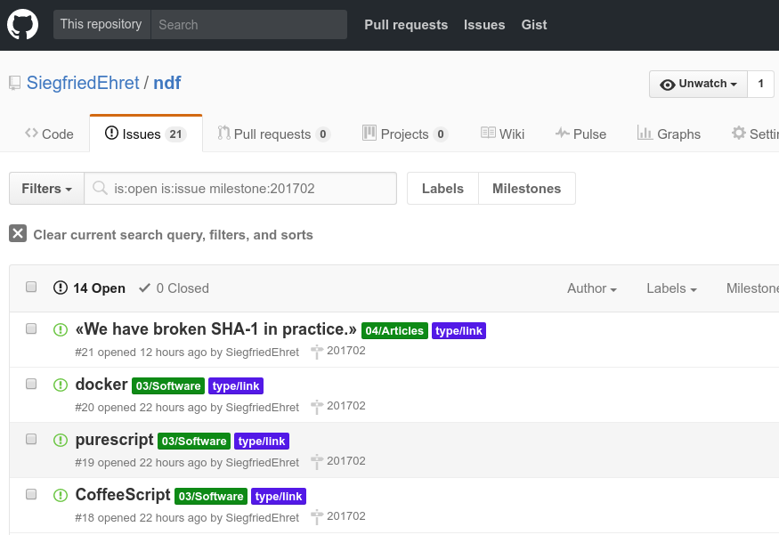
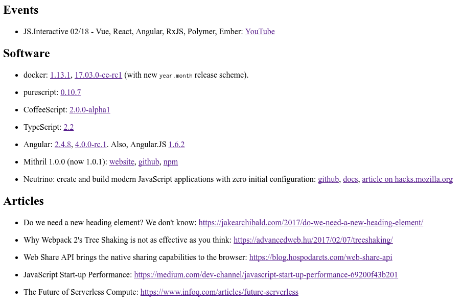

# ndf

This connects to Github to build a list of links and stuff.

TL;DR from:



to:



## CLI options

- `-owner=<owner>` the owner of the Github repository
- `-repo=<repo>` the repo to check for issues
- `-milestone=<milestone>` the name of the milestone to process

If you need:

- `-d` debug mode !

## How to organize your issues

Using milestones and tags.

Organise your labels (= section titles) using `<number>/<title>`, for example (`01/Events`). The number before the slash `/` won't be shown in the titles.

2 tags are supported for content types:

- `type/link`
- `type/text`

## How to run

```bash
./ndf -owner=SiegfriedEhret -repo=ndf -milestone=201702 -d
```
